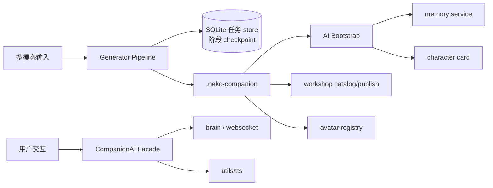

# Companion Platform Architecture

## 模块划分（Phase 5 M4/M6 后）

```
companion/
├── models/          # CompanionProfile, GenerationInput, Manifest
├── generator/       # 长任务 Pipeline、SQLite 任务 store（HA）、上传持久化、
│                    # 开源模型探测（open_source.py）、声线映射、
│                    # 语料 fact 种子阶段（extract_fact_seeds，Phase 5 M4）
├── ai/              # 记忆/人设/对话/TTS Facade
│   ├── chat.py            # 文字对话 facade（conversation tier + WS 协议帧）
│   ├── realtime_voice.py  # 语音对话 facade（realtime tier + api_type）
│   ├── runtime.py         # 两个对话 facade 共用的运行时/脱敏解析
│   ├── bootstrap.py       # 生成产物 → persona 记忆种子 + fact 层种子（M4）
│   ├── refine.py          # 人设迭代：correction tier 一轮 LLM → diff 提案（M4）
│   └── persona_versions.py # 角色卡版本链快照 / 回滚（M4）
├── avatar/          # 形象注册（SQLite 持久化，store.py）、Live2D 桥接、特效
├── productivity/    # 番茄钟/Todo/备忘/媒体监测（SQLite 持久化）
├── workshop/        # 创意工坊导出/目录扫描（export.py，Phase 4）
├── sync/            # 移动同步协议 v1.0：manifest 快照 + 记忆增量（Phase 5 M6）
└── api/             # FastAPI 路由聚合（/api/companion/*）

static/companion/    # 向导 wizard/、工坊 workshop/、生产力面板 productivity/、
                     # avatar 面板 avatar/、共享 i18n.js（8 locale）
```

## 数据流



## 集成点

| 现有模块 | Companion 集成方式 |
|----------|-------------------|
| `memory/` | `companion/ai/memory_bridge.py` 代理 memory server (48912)；`bootstrap.py` 复用在跑 `PersonaManager` 写种子 |
| `main_routers/characters_router` | `persona.py` 角色卡双向映射 / 注册，导入后 best-effort 通知 memory `/reload` |
| `main_routers/websocket_router` | `chat.py` / `realtime_voice.py` 输出与 `/ws/{name}` 逐字段一致的协议帧（facade 不自行开 socket） |
| `main_routers/live2d_router` | Avatar loader 复用模型目录；包内资源经 `/api/companion/avatar/{id}/resource/{path}` 直出 |
| `utils/tts/` | `tts_bridge.py` 统一声线配置 |
| `app/main_server/web_app.py` | 挂载 `companion_router`（经 `main_routers/companion_router`） |
| `static/locales/*.json` | 向导/工坊/面板 UI 文案，8 locale 同步（`static/companion/i18n.js` 加载） |

## 对话会话 API（Phase 4）

- `GET /api/companion/session/{character_name}` — 聚合文字 + 语音两个 facade 的
  会话元数据：websocket 路由、脱敏 provider tier 配置、协议帧、runtime live
  状态（主服务器未启动时降级为 `runtime.available = false`）。
- `POST /api/companion/dialogue/session` — 由 companion profile 生成
  文字/语音双通道的 connect info（角色路由 + locale + 记忆角色名）。

## 任务 HA（Phase 4）

生成任务持久化在 SQLite（`generation_tasks` 表，路径经
`NEKO_COMPANION_TASKS_DB_PATH` 覆盖），每阶段输出写 `stage_results`
checkpoint；`POST /generate/{task_id}/retry` 从失败阶段恢复（已完成的 LLM
阶段不重跑），全部生成端点支持 `?background=true` 异步模式。详见
[COMPANION_GENERATOR.md](./COMPANION_GENERATOR.md)。

## Avatar Registry 持久化（Phase 5 M2）

avatar 注册表与生成任务 store 结构对偶：profile 以 JSON payload 行落
SQLite（`avatar_profiles` + `avatar_registry_state` 两张表，路径经
`NEKO_COMPANION_AVATAR_DB_PATH` 覆盖，默认在用户数据目录
`companion/avatar_registry.db`）。`companion/api/routes.py` 首次访问
avatar 路由时经 `companion.avatar.store.get_avatar_registry()` 惰性恢复：
已导入的 profile、active 选择、以及 Phase 3 的 effects 装饰配置
（`profile.effects["decorations"]`）都随 payload 一起还原，导入后重启
`/avatar/list` 与资源端点仍然可用。

`DELETE /api/companion/avatar/{profile_id}` 从注册表移除 profile（持久
化，active 自动回退到剩余 profile）；`?delete_package=true` 连带删除包
目录，但仅接受位于受管 companions 数据根（`<docs>/N.E.K.O/companions`，
可经 `NEKO_COMPANION_PACKAGES_ROOT` 覆盖）内、且含 `manifest.json` 的
目录 —— 路径逃逸或非包目录返回 409 且注册表不变。

## 运行指标（Phase 5 M3）

`GET /api/companion/metrics` 在 async 路由内通过 `asyncio.to_thread` 调用
`companion.metrics.collect_companion_metrics`：聚合生成任务 SQLite（成功率、
平均耗时、LLM/Ollama/heuristic 路由占比）、workshop catalog 条目数、
productivity 使用计数等只读统计，不引入新监控依赖。

生成 pipeline 各阶段在 checkpoint 时记录耗时；`GET /generate/{task_id}` 响应
包含 `stage_timings_ms` 字段供调试与 UI 展示。

## 工坊目录与资源（Phase 5 M5）

除 `GET /workshop/catalog` 与 `POST /workshop/publish/{task_id}` 外，目录页依赖：

- `GET /workshop/entry/{catalog_id}` — bundle 元数据（封面、标签、简介、作者等）。
- `GET /workshop/asset/{catalog_id}/{path}` — catalog 包内静态文件（封面图、预览资源），
  路径规范化并拒绝目录逃逸。

前端 `static/companion/workshop/` 以卡片网格 + 预览弹层消费上述 API，一键导入仍走
`POST /import` 或既有 avatar 导入路径。

## 记忆 / 人设深化（Phase 5 M4）

**语料 → fact 种子**：生成 pipeline 新增可选阶段 `extract_fact_seeds`
（`GenerationInput.extract_fact_seeds`，默认关闭）。开启且 LLM 可用时，
`summary` tier 从语料抽取高置信事实（`COMPANION_FACT_SEED_MIN_CONFIDENCE`
过滤、上限 `COMPANION_FACT_SEED_MAX_SEEDS`）写入 manifest；导入时
`bootstrap.py` 经 memory 管线的 fact 写入路径落 fact 层，每条带
`external_import` 溯源标记。该阶段 **LLM-only、无启发式兜底**——LLM 不可用
时返回空列表，生成任务不失败（fabricated facts 比缺 facts 更糟）。

**人设迭代与版本**（refine 走 `correction` tier，不配置则 503，不做静默
模型降级）：

- `POST /persona/{name}/refine` — 基于现有卡片 system prompt + 用户反馈的
  一轮 LLM 微调，返回 old/new + unified diff **提案**，不落盘。
- `POST /persona/{name}/refine/apply` — 用户确认后写回；写前先把旧卡片
  快照进版本链（`companion/ai/persona_versions.py`，每角色独立备份文件，
  上限 `COMPANION_PERSONA_VERSION_MAX_SNAPSHOTS`）；
  `expected_system_prompt` 不匹配返回 409（乐观锁）。
- `GET /persona/{name}/versions` / `POST /persona/{name}/rollback` — 列出与
  回滚快照；回滚前当前卡片也会快照（`pre_rollback`），且卡片 **key 不变**，
  以角色名为键的记忆文件（persona.json / facts.json）与回滚后的卡片保持
  一致。

## 移动同步协议（Phase 5 M6）

协议规范见 **[SYNC_PROTOCOL.md](./SYNC_PROTOCOL.md)**（v1.0，只读、
桌面权威 desktop-authoritative）。实现在 `companion/sync/service.py`，
路由经 `asyncio.to_thread` offload：

- `GET /api/companion/sync/manifest` — 设备级快照：每个已注册 companion
  一条 `.neko-companion` manifest（交换单元，接收端直接走 `POST /import`）
  + fact 层最新游标 + persona digest。
- `GET /api/companion/sync/memory/{name}?since=...&limit=...&include_persona=...`
  — 单角色记忆增量：`(created_at, id)` 复合游标严格全序，幂等 / 分页 /
  断点续传；只出可携带字段（embedding 等派生缓存不出网）；persona 层
  digest 比对 + snapshot-on-change 整体替换。未注册角色 404。

鉴权沿用主服务器既有机制，路由不自造凭据体系；移动端客户端后置，协议以
双桌面实例验证（协议文档 §7）。

## API 前缀

所有 Companion API 使用 `/api/companion` 前缀，**不带末尾斜杠**。
