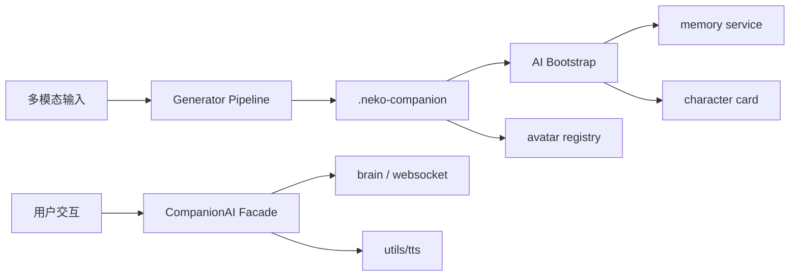

# Companion Platform Architecture

## 模块划分

```
companion/
├── models/          # CompanionProfile, GenerationInput, Manifest
├── generator/       # 长任务 Pipeline、任务状态机
├── ai/              # 记忆/人设/对话/TTS Facade（并行 Agent E）
├── avatar/          # 形象注册、Live2D 桥接、特效（并行 Agent D）
├── productivity/    # 番茄钟/Todo/备忘/媒体监测（并行 Agent C）
└── api/             # FastAPI 路由聚合
```

## 数据流



## 集成点

| 现有模块 | Companion 集成方式 |
|----------|-------------------|
| `memory/` | `companion/ai/memory_bridge.py` 代理 memory server (48912) |
| `main_routers/characters_router` | Persona 导入/导出 |
| `main_routers/live2d_router` | Avatar loader 复用模型目录 |
| `utils/tts/` | `tts_bridge.py` 统一声线配置 |
| `app/main_server/web_app.py` | 挂载 `companion_router` |

## API 前缀

所有 Companion API 使用 `/api/companion` 前缀，**不带末尾斜杠**。
