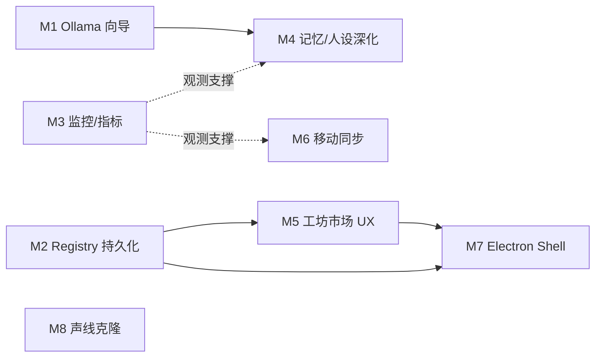

# Phase 5+ 开发计划（进一步发展规划）

> 前提：Phase 1–4 已交付（见 [ROADMAP.md](./ROADMAP.md)）。执行状态与
> M1 / M2 subagent 交接说明见 [PHASE5_STATUS.md](./PHASE5_STATUS.md)。本计划按**优先级 +
> 里程碑**组织，不做日历排期；每个条目给出验收标准与主要触点，便于并行
> agent 认领。横向约束沿用 `.agent/rules/neko-guide.md`：API 不带末尾斜杠、
> UI 文案 8 locale 同步、辅助 LLM 调用走 tier + budget + timeout、async 路径
> 零阻塞。

## 优先级总览

| 优先级 | 主题 | 动机 |
|--------|------|------|
| P0 | Ollama 一键配置向导 | Phase 4 唯一未完成的必达项缺口（检测/路由已有，缺引导 UI） |
| P0 | Avatar registry 持久化 | 当前进程内存态，重启后热替换列表丢失，直接影响日常使用 |
| P1 | 监控 / 指标 | 生成任务与对话 facade 已 HA 化，但无可观测性 |
| P1 | 记忆 / 人设深度集成 | 种子只进 persona 层；语料价值未充分利用 |
| P1 | 工坊市场体验（Marketplace UX） | catalog/publish 是文件级原语，缺浏览/预览/评分体验 |
| P1 | 移动端 Companion 同步协议 | Phase 4 遗留；跨平台愿景的关键一环 |
| P2 | Electron Companion Shell | 桌面分发形态；依赖上面多项稳定后收口 |
| P2 | 声线克隆与 TTS 深化 | 参考音频目前只做映射启发式 |

---

## M1 — Ollama 一键配置向导（P0）

**现状**：`companion/generator/open_source.py` / `companion/ai/open_source.py`
已能探测本地 daemon（`GET /api/tags`）并产出 `get_model_api_config` 形状的
路由；`GET /api/companion/ai/open-source` 暴露探测结果。缺的是面向用户的
配置流。

**交付物**：

1. `static/companion/wizard/` 增加「本地模型」步骤（或独立
   `static/companion/ollama/` 页面）：探测状态展示、模型列表选择、
   未安装时的安装指引（按 OS 分支）。
2. 写入端点 `POST /api/companion/ai/open-source/config`：把选中的模型
   落到 `config/api_providers.json` 对应 tier（复用 config_manager 写入
   路径，async 侧走 `a*` 版本）。
3. i18n：新增文案同步 8 个 locale。

**验收**：全新机器（无云端 key）从向导进入 → 检测到 Ollama → 选模型 →
生成一个 companion 全程不碰 heuristic 降级；`tests/unit/` 覆盖 config 写入
与探测失败降级路径。

## M2 — Avatar Registry 持久化 + 生成产物管理（P0）

**现状**：`companion/api/routes.py` 的 `_avatar_registry` 是模块级内存对象；
重启后已导入的 avatar 需要重新 `/import`。

**交付物**：

1. registry 落盘（JSON 或复用 productivity 的 SQLite 模式，二选一，与
   `GenerationTaskStore` 结构对偶），启动时惰性恢复；active 状态一并持久化。
2. `DELETE /api/companion/avatar/{profile_id}` 与包目录 GC 策略
   （uploads session 目录 + workshop 导出目录的清理端点）。
3. effects 配置（`profile.effects["decorations"]`）随 registry 一起持久化，
   补上 Phase 3 特效不落盘的缺口。

**验收**：导入 → 重启进程 → `/avatar/list` 仍返回该 avatar 且资源端点可用；
单测覆盖恢复与并发写。

## M3 — 监控 / 指标（P1）

**现状**：生成任务有 SQLite 审计痕迹（status/attempts/error），但没有聚合
视图；对话 facade、workshop、productivity 无任何指标。

**交付物**：

1. `GET /api/companion/metrics`：任务成功率 / 平均耗时 / LLM 降级率
   （读 `generator_metadata.llm`）、workshop 条目数、productivity 使用计数。
   纯读 SQLite + 文件系统，`asyncio.to_thread` offload。
2. 生成 pipeline 各阶段耗时写入 `stage_results`（已有 checkpoint 机制，
   加时间戳即可），任务详情 API 透出。
3. 可选：接入现有 `requirements_monitor.txt` 的监控形态时保持解耦——
   companion 侧只出 JSON 端点，不引入新依赖。

**验收**：跑 N 个生成任务后 metrics 端点能区分 llm/ollama/heuristic 路由
占比；阶段耗时在 `GET /generate/{task_id}` 可见。

## M4 — 记忆 / 人设深度集成（P1）

**现状**：`bootstrap.py` 把 manifest `memory_seeds` 写入 persona 层
（`source="companion_seed"`）；语料本身没有进入 fact 层，人设生成后
不可迭代。

**交付物**：

1. **语料 → fact 种子**：generator 新增可选阶段（默认关），把语料中的
   高置信事实经 memory 管线的 fact 写入路径落到 fact 层，复用
   `summary` tier（budget/timeout 遵循 neko-guide，不新增 hardcoded 模型）。
2. **人设迭代**：`POST /api/companion/persona/{name}/refine` —— 基于既有
   卡片 + 用户反馈的一轮 LLM 微调，产出 diff 供确认后写回（走
   `correction` tier 语义）。
3. **人设版本**：characters.json 卡片写入前保留上一版本快照
   （`_reserved` 内 version 链或独立备份文件），提供回滚端点。

**验收**：导入后 `GET /new_dialog/{name}` 首轮上下文含种子事实；refine 全
流程有单测（LLM mock）；回滚后卡片与记忆键一致。

## M5 — 工坊市场体验（P1）

**现状**：`companion/workshop/export.py` 提供 catalog 扫描与 bundle 导出；
`static/companion/workshop/` 是薄目录页。发布 = 本地文件导出，无预览/
元数据丰富度。

**交付物**：

1. bundle 元数据扩展：封面图（取参考图第一张或 L2D 快照）、标签、
   简介、作者字段进 manifest；catalog API 透出。
2. workshop 页升级：卡片网格 + 预览弹层（形象缩略图 + 人设摘要 +
   声线信息）+ 一键导入按钮（复用 `/import`）。
3. 与 Steam Workshop 的衔接调研结论落文档：`.neko-companion` 与现有
   Steam 创意工坊角色卡分发格式的互转边界（只做调研与格式对齐，不在
   本里程碑实现上传）。
4. i18n：8 locale 同步。

**验收**：发布 → 目录页可视化浏览 → 预览 → 导入闭环无需命令行；导出包
在另一台安装上导入后形象/人设/声线齐全。

## M6 — 移动端 Companion 同步协议（P1）

**现状**：未开始（Phase 4 遗留）。桌面端已有完整 profile + 记忆 + 包格式。

**交付物**（协议先行，客户端后置）：

1. 同步协议规范文档：以 `.neko-companion` manifest 为交换单元，
   记忆增量用 memory 层已有的事实/时间索引做游标；明确冲突策略
   （桌面权威 / 最后写入胜，二选一并写明理由）。
2. `GET /api/companion/sync/manifest` + `GET /api/companion/sync/memory/{name}?since=...`
   只读端点（鉴权沿用主服务器既有机制，不自造）。
3. 移动端最小可行客户端**不在本里程碑**——先用第二台桌面实例验证协议。

**验收**：两台桌面实例经同步端点搬运同一 companion，记忆增量拉取幂等；
协议文档进 `docs/companion-platform/`。

## M7 — Electron Companion Shell（P2）

**现状**：N.E.K.O. 已有 Electron 分发形态（`/chat`、`/subtitle` 等独立窗口
路由，见 neko-guide「开发环境 vs Electron 分发」）。Companion 页面目前只在
浏览器验证过。

**交付物**：

1. 向导 / 工坊 / 生产力面板适配 Electron 窗口路由（新增 `/companion/*`
   页面路由或复用 `static/` 直出，需与现有双模式约定一致）。
2. 生产力面板作为常驻小窗（widget mode 集成）：番茄钟状态与 avatar
   联动在桌面宠物模式可见。
3. 打包验证：PyInstaller spec（`specs/`）包含 `companion/` 与
   `static/companion/`；冒烟脚本进 CI。

**验收**：Electron 构建内向导全流程可用；生产力小窗在桌面宠物模式随
avatar 联动。

## M8 — 声线克隆与 TTS 深化（P2）

**现状**：`voice_mapping.py` 从参考音频做启发式映射到已有 provider 声线；
无真实克隆。

**交付物**：

1. 支持克隆的 TTS provider（如 GPT-SoVITS / fish-speech 本地部署）接入
   `utils/tts/` provider 体系（遵循对偶性：与现有 provider 同构拆分），
   companion 侧只在 `tts_bridge.py` 增加克隆声线的引用。
2. 生成 pipeline `configure_voice` 阶段在检测到克隆 provider 可用时
   走克隆路径，产物 voice/config.json 记录克隆引用。
3. `/tts/preview` 支持克隆声线试听。

**验收**：提供参考音频 → 生成 → 试听端点播的是克隆声线；克隆 provider
不可用时静默回退映射启发式（生成不失败，与 LLM 降级同一哲学）。

---

## 不做清单（明确排除）

- 云端集中式 companion 托管 / 账号体系——与本地优先原则冲突，暂不立项。
- 工坊内购 / 付费分发——商业化机制等 Steam Workshop 衔接调研（M5.3）
  结论后再议。
- 移动端原生客户端实现——M6 只做协议与桌面双实例验证。

## 里程碑依赖关系

M1 / M2 / M3 相互独立，可并行认领；M7 收口在 M2、M5 之后。

---

## Phase 5 第二、三波（已合入 `main`）

> 执行快照见 [PHASE5_PROGRESS.md](./PHASE5_PROGRESS.md)。第二波交付
> M1/M2/M3/M5，第三波交付 M4/M6——**M1–M6 全部完成**；后续以 M7/M8 收口
> （见下「第三波后」）。

| 里程碑 | 状态 | 备注 |
|--------|------|------|
| M1 Ollama 向导 | 已完成 | PR #9 |
| M2 Avatar 持久化 | 已完成 | PR #8 |
| M3 监控/指标 | 已完成 | `5297af8f` |
| M5 工坊市场 UX | 已完成 | `b90efb72` |
| M4 记忆/人设 | 已完成 | PR [#12](https://github.com/KatouRyuuji/N.E.K.O/pull/12)：fact 种子（`extract_fact_seeds`）、refine/apply、版本链+回滚 |
| M6 移动同步 | 已完成 | PR [#11](https://github.com/KatouRyuuji/N.E.K.O/pull/11)：[SYNC_PROTOCOL.md](./SYNC_PROTOCOL.md) v1.0、`/sync/manifest` + `/sync/memory/{name}` |
| M7 Electron | **待认领** | P2，依赖 M2+M5（已就绪） |
| M8 声线克隆 | **待认领** | P2 |

**验收习惯（沿用）**：认领分支 → `uv run pytest tests/unit/test_companion_*.py`
（CI `companion-tests.yml` 在 push / PR 自动跑同一命令）→ PR → 合入 `main`
后更新 PHASE5_PROGRESS / STATUS。当前基线 **219 passed**（2026-08-25）。

**第三波后**：优先 **M7 Electron Shell**（依赖已全部就绪；建议把 M4 refine
的确认式 diff UI 一并收进 Electron 页面），随后 **M8 声线克隆**；剩余体验
缺口（#6 联动 / #7 装饰 / 移动端原生客户端）见
[GAP_ANALYSIS.md](./GAP_ANALYSIS.md) 与 [PHASE5_PROGRESS.md](./PHASE5_PROGRESS.md)。
